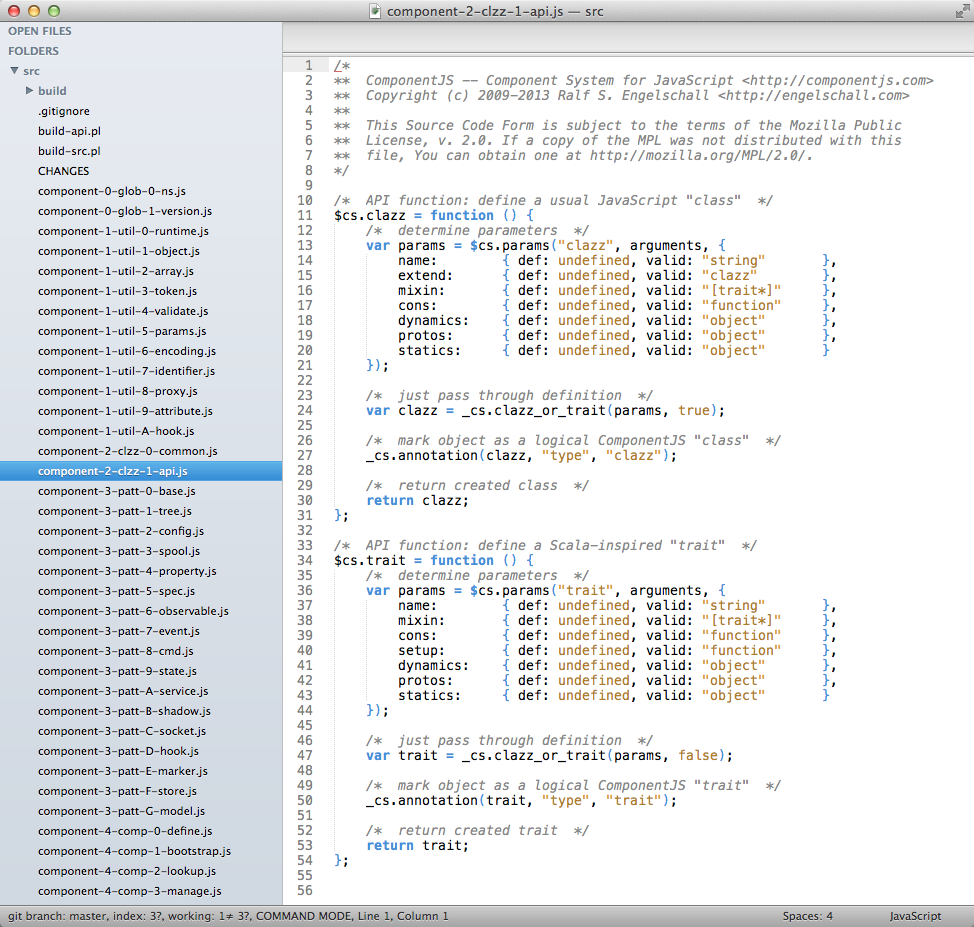

Sublime Text Color Scheme RSE
=============================

This is Ralf S. Engelschall (RSE)'s discreet color scheme for the
Sublime Text editor (http://www.sublimetext.com/). It uses just 4
colors: "white" for the background, "black" as the default text color,
"blue" for all language constructs (keywords and punctation characters)
and "brown" for all literals (strings, numbers, etc). Nothing more,
nothing less! 

For a very elegant coding environment, my preferred setup is:

1. Install Sublime Text 2 
   http://www.sublimetext.com/ 
   (the editor itself)

2. Install Package Control for Sublime Text 2: 
   http://wbond.net/sublime_packages/package_control  
   (the package manager for the editor)

3. Install theme "Soda Light" via Package Control 
   http://buymeasoda.github.io/soda-theme/  
   (the GUI theme for the editor)

4. Install this color schema "Color Schema - RSE" via Package Control 
   https://github.com/rse/sublime-scheme-rse 
   (the color scheme for the text area)

5. Install the DejaVu font family 
   http://dejavu-fonts.org/ 
   (the font for the text area)

6. Use the Sublime Text 2 User Preferences below, which enables the
   theme, color scheme and font and especially reduces the total line
   height (very important as for coding we need the maximum number of
   lines on the screen).

User Preferences
----------------

    {
        "theme": "Soda Light.sublime-theme",
        "soda_classic_tabs": true,
        "color_scheme": "Packages/Color Scheme - RSE/RSE.tmTheme",
        "font_face": "DejaVu Sans Mono",
        "line_padding_bottom": -2,
        "line_padding_top": 0
    }

Screenshot
----------

License
-------

Copyright &copy; 2012-2013 Ralf S. Engelschall (rse@engelschall.com)

Permission is hereby granted, free of charge, to any person obtaining
a copy of this software and associated documentation files (the
"Software"), to deal in the Software without restriction, including
without limitation the rights to use, copy, modify, merge, publish,
distribute, sublicense, and/or sell copies of the Software, and to
permit persons to whom the Software is furnished to do so, subject to
the following conditions:

The above copyright notice and this permission notice shall be included
in all copies or substantial portions of the Software.

THE SOFTWARE IS PROVIDED "AS IS", WITHOUT WARRANTY OF ANY KIND,
EXPRESS OR IMPLIED, INCLUDING BUT NOT LIMITED TO THE WARRANTIES OF
MERCHANTABILITY, FITNESS FOR A PARTICULAR PURPOSE AND NONINFRINGEMENT.
IN NO EVENT SHALL THE AUTHORS OR COPYRIGHT HOLDERS BE LIABLE FOR ANY
CLAIM, DAMAGES OR OTHER LIABILITY, WHETHER IN AN ACTION OF CONTRACT,
TORT OR OTHERWISE, ARISING FROM, OUT OF OR IN CONNECTION WITH THE
SOFTWARE OR THE USE OR OTHER DEALINGS IN THE SOFTWARE.

